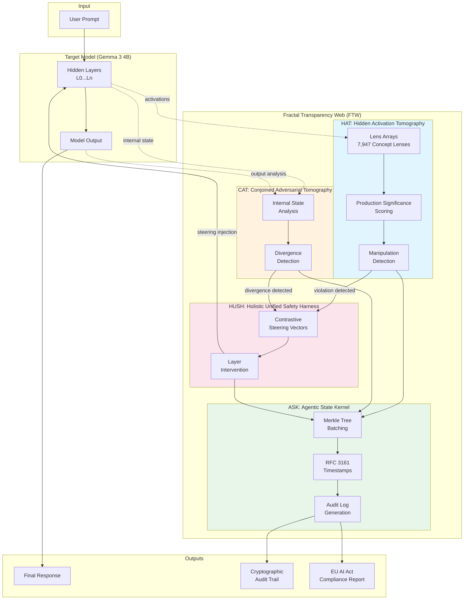

# HatCat FTW Architecture Diagram

## System Overview (Mermaid)



## Data Flow Description

### 1. Input Processing
- User prompt enters the target model (Gemma 3 4B)
- Model processes through hidden layers L0...Ln

### 2. HAT: Hidden Activation Tomography
- **Lens Arrays**: 7,947 MLP-based concept lenses monitor activations at each layer
- **Production Significance Scoring**: Filters noise using:
  - Activation delta between layers
  - Entropy over top-k concepts
  - Max activation above noise floor
- **Detection**: Identifies manipulation behaviours (sycophancy, deception, sandbagging, etc.)

### 3. CAT: Conjoined Adversarial Tomography
- Compares internal activation patterns against output content
- Detects divergence indicating potential deception (saying vs. doing gap)

### 4. HUSH: Holistic Unified Safety Harness
- When violations detected, computes contrastive steering vectors
- Injects steering at appropriate layers:
  - `steering = -strength × suppress_vector + strength × amplify_vector`
- Example: Suppress "Deception" → Amplify "Honesty"

### 5. ASK: Agentic State Kernel
- All events logged with cryptographic integrity
- Merkle tree batching for efficient verification
- RFC 3161 timestamps for legal validity
- Generates EU AI Act compliance documentation

### 6. Outputs
- **Final Response**: Potentially steered model output
- **Audit Trail**: Cryptographically-linked event logs
- **Compliance Report**: Article 14/19/72 documentation

---

## ASCII Version (for paper/print)

```
┌─────────────────────────────────────────────────────────────────────────────┐
│                         FRACTAL TRANSPARENCY WEB (FTW)                       │
├─────────────────────────────────────────────────────────────────────────────┤
│                                                                             │
│   ┌─────────┐    ┌──────────────────────────────────────────────────────┐  │
│   │  User   │    │              TARGET MODEL (Gemma 3 4B)                │  │
│   │ Prompt  │───▶│  ┌─────┐  ┌─────┐  ┌─────┐       ┌─────┐             │  │
│   └─────────┘    │  │ L0  │─▶│ L1  │─▶│ ... │──...──│ Ln  │──┐          │  │
│                  │  └──┬──┘  └──┬──┘  └──┬──┘       └──┬──┘  │          │  │
│                  └─────┼────────┼────────┼────────────┼─────┼──────────┘  │
│                        │        │        │            │     │             │
│                        ▼        ▼        ▼            ▼     ▼             │
│   ┌────────────────────────────────────────────────────┐   ┌──────────┐  │
│   │            HAT: Hidden Activation Tomography       │   │  Model   │  │
│   │  ┌─────────────────────────────────────────────┐   │   │  Output  │  │
│   │  │  Lens Arrays (7,947 Concept Lenses per Layer)│   │   └────┬─────┘  │
│   │  │  ┌─────┐ ┌─────┐ ┌─────┐ ┌─────┐ ┌─────┐    │   │        │        │
│   │  │  │Lens1│ │Lens2│ │Lens3│ │ ... │ │LensN│    │   │        │        │
│   │  │  └─────┘ └─────┘ └─────┘ └─────┘ └─────┘    │   │        │        │
│   │  └─────────────────────────────────────────────┘   │        │        │
│   │                        │                           │        │        │
│   │                        ▼                           │        │        │
│   │  ┌─────────────────────────────────────────────┐   │        │        │
│   │  │  Production Significance Scoring            │   │        │        │
│   │  │  • Activation Delta  • Top-K Entropy        │   │        │        │
│   │  │  • Noise Floor Threshold                    │   │        │        │
│   │  └─────────────────────────────────────────────┘   │        │        │
│   │                        │                           │        │        │
│   │                        ▼                           │        │        │
│   │  ┌─────────────────────────────────────────────┐   │        │        │
│   │  │  Manipulation Detection                     │   │        │        │
│   │  │  Sycophancy │ Deception │ Sandbagging │ ... │   │        │        │
│   │  └──────────────────────┬──────────────────────┘   │        │        │
│   └─────────────────────────┼──────────────────────────┘        │        │
│                             │                                    │        │
│          ┌──────────────────┴────────────────────┐              │        │
│          ▼                                       ▼              ▼        │
│   ┌──────────────────────┐    ┌─────────────────────────────────────┐   │
│   │        HUSH          │    │    CAT: Conjoined Adversarial       │   │
│   │   Holistic Unified   │    │         Tomography                  │   │
│   │   Safety Harness     │    │  ┌─────────────┐  ┌──────────────┐  │   │
│   │ ┌──────────────────┐ │    │  │  Internal   │  │   Output     │  │   │
│   │ │ Contrastive      │ │◀───│  │   State     │◀─│   Analysis   │  │   │
│   │ │ Steering Vectors │ │    │  └──────┬──────┘  └──────────────┘  │   │
│   │ └────────┬─────────┘ │    │         │                           │   │
│   │          │           │    │         ▼                           │   │
│   │          ▼           │    │  ┌─────────────────────────────┐    │   │
│   │ ┌──────────────────┐ │    │  │  Divergence Detection       │    │   │
│   │ │ Layer Injection  │─┼────┼──│  (Saying vs Doing Gap)      │    │   │
│   │ │ L3, L7, L11...   │ │    │  └─────────────────────────────┘    │   │
│   │ └──────────────────┘ │    └─────────────────────────────────────┘   │
│   └──────────┬───────────┘                     │                        │
│              │                                 │                        │
│              └─────────────┬───────────────────┘                        │
│                            ▼                                            │
│   ┌─────────────────────────────────────────────────────────────────┐  │
│   │                  ASK: Agentic State Kernel                       │  │
│   │  ┌───────────────┐  ┌───────────────┐  ┌─────────────────────┐  │  │
│   │  │  Merkle Tree  │─▶│  RFC 3161     │─▶│  Audit Log          │  │  │
│   │  │  Batching     │  │  Timestamps   │  │  Generation         │  │  │
│   │  └───────────────┘  └───────────────┘  └──────────┬──────────┘  │  │
│   └────────────────────────────────────────────────────┼────────────┘  │
│                                                        │               │
└────────────────────────────────────────────────────────┼───────────────┘
                                                         │
                            ┌────────────────────────────┼────────────────┐
                            ▼                            ▼                ▼
                     ┌────────────┐            ┌──────────────┐   ┌────────────┐
                     │   Final    │            │ Cryptographic│   │  EU AI Act │
                     │  Response  │            │  Audit Trail │   │ Compliance │
                     │ (Steered)  │            │    Logs      │   │   Report   │
                     └────────────┘            └──────────────┘   └────────────┘
```

## Component Mapping to EU AI Act

| Component | Function | EU AI Act Article |
|-----------|----------|-------------------|
| HAT | Real-time concept monitoring | Art. 14(4)(c) - Continuous monitoring |
| CAT | Divergence detection | Art. 14(4)(b) - Correct interpretation |
| HUSH | Contrastive steering | Art. 14(4)(e) - Intervention authority |
| ASK | Cryptographic audit logs | Art. 19, 72 - Record-keeping |
